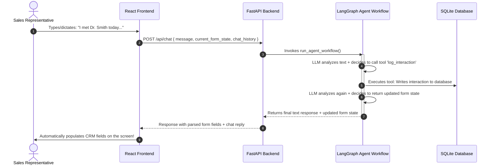

# AIVOA CRM: AI-First HCP Module

An AI-powered CRM module designed for Healthcare Professional (HCP) interaction logging. Using a LangGraph agent workflow coupled with a React frontend and FastAPI backend, it automatically parses natural language conversation summaries to populate CRM records, audit logs, and schedule follow-ups.

---

## 🚀 Key Features

* **AI-Assisted Interaction Logging:** Dictate or type summaries of meetings with HCPs (e.g., topics discussed, sentiment, materials shared).
* **Dynamic Form Synchronization:** Real-time form population on the UI matching the parsed details of the conversation.
* **Sentiment & Topic Analysis:** Automatically flags sentiment (Positive/Neutral/Negative) and aggregates discussion points.
* **Audit Trail History:** SQLite database tracks logged interactions and scheduled follow-up tasks.
* **Test Automation Script:** Sandbox script to run and trace the LangGraph workflow directly in terminal.

---

## 🧠 How It Works & Architecture

The AIVOA CRM reduces manual data entry for medical representatives. Instead of filling out complex forms, a rep describes the meeting in natural language, and the AI agent automatically parses the content, updates the database, and synchronizes the frontend form state.

### System Architecture & Data Flow



### Core Architecture Components

* **Frontend (React + Vite):** 
  Features a split-pane layout: **CRM Form** on the left and **AI Assistant** on the right. Inputs on the left update in real time as the Redux state receives new forms from the backend.
* **FastAPI Backend:**
  Bridge between the UI and agent. Receives the user prompt and forwards it to the LangGraph runner. Also manages the SQLite database sessions.
* **LangGraph Agent Workflow:**
  Stateful LLM workflow using LangGraph and ChatGroq. Resolves the prompt by checking if custom database actions (tools) need execution, updates the database, updates the form fields, and replies to the user.

---

## 🛠️ Project Structure

```text
AIVOA/
├── backend/            # FastAPI + LangGraph Agent
│   ├── app/
│   │   ├── agent.py    # LangGraph workflow definitions
│   │   ├── main.py     # FastAPI application & entrypoint
│   │   ├── database.py # SQLite database schemas & model
│   │   ├── config.py   # Settings & configuration
│   │   ├── tools.py    # LLM tool definitions
│   │   └── schemas.py  # Pydantic schemas
│   ├── requirements.txt
│   └── test_workflow.py # Sandbox testing script
└── frontend/           # React + TypeScript SPA (Vite)
    ├── src/
    │   ├── components/ # Chat panel, interaction forms, etc.
    │   ├── store/      # Redux state management
    │   └── App.tsx     # App layout
    └── vite.config.ts  # Vite configuration (Port Proxy)
```

---

## 💻 Getting Started

### Prerequisites
* **Node.js** (v18+)
* **Python** (v3.10+)
* **Groq API Key** (for agent execution)

---

### 1. Backend Setup & Run

1. Navigate to the `backend` directory:
   ```bash
   cd backend
   ```

2. Create and activate a Python virtual environment:
   ```bash
   python -m venv venv
   # On Windows (PowerShell)
   .\venv\Scripts\Activate.ps1
   # On Unix/macOS
   source venv/bin/activate
   ```

3. Install the dependencies:
   ```bash
   pip install -r requirements.txt
   ```

4. Create or edit the `backend/.env` file with your Groq API Key:
   ```env
   GROQ_API_KEY=your-actual-groq-api-key
   ```

5. Run the FastAPI development server:
   ```bash
   python -m app.main
   ```
   *The backend will run on `http://localhost:8000`. You can access interactive API docs at `http://localhost:8000/docs`.*

---

### 2. Frontend Setup & Run

1. Navigate to the `frontend` directory:
   ```bash
   cd ../frontend
   ```

2. Install dependencies:
   ```bash
   npm install
   ```

3. Run the Vite development server:
   ```bash
   npm run dev
   ```
   *The frontend will run on `http://localhost:5173/`. Vite automatically proxies requests starting with `/api` to the backend on `http://localhost:8000`.*

---

### 🧪 Running Sandbox Workflow Tests
To run a test conversation directly through the agent workflow in isolation (without launching the frontend or backend servers):
```bash
cd backend
python test_workflow.py
```
This script runs a test prompt through the LangGraph sequence and prints the final extracted form state and tool execution logs.
